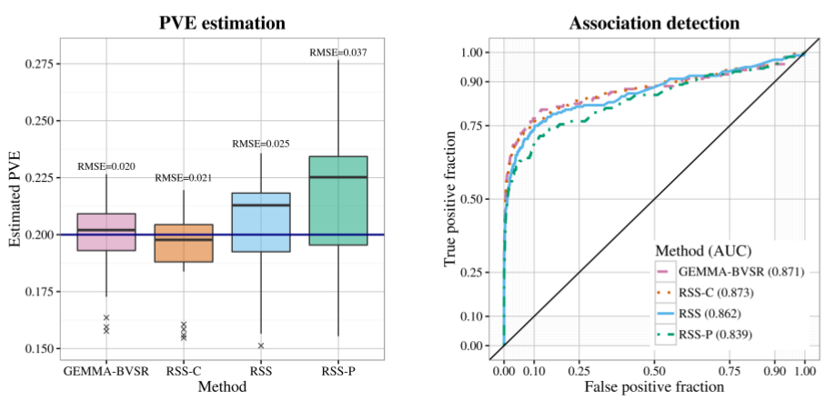
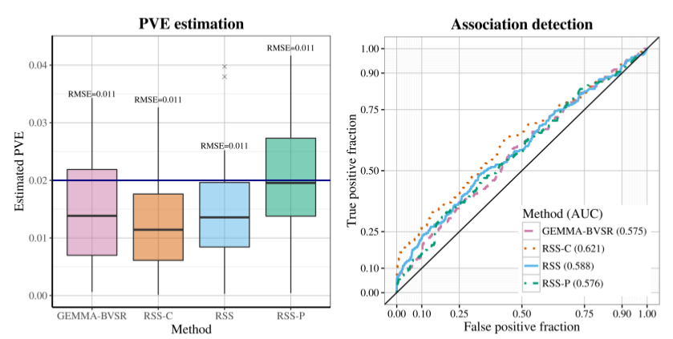
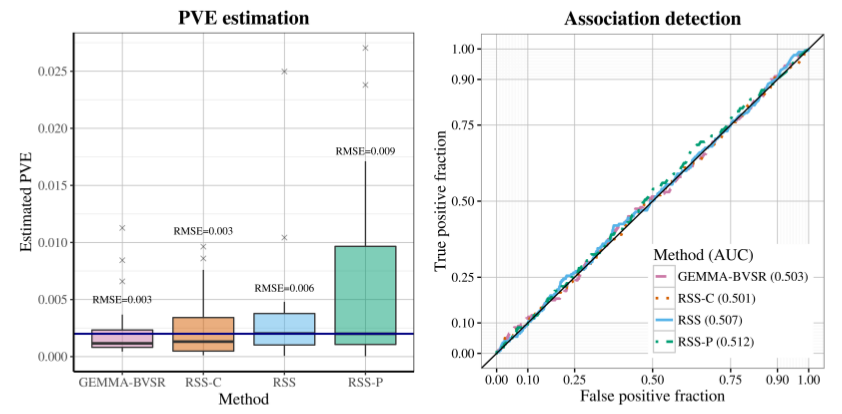

## Example 2: Choice of LD matrix

### Overview
This example illustrates the impact of different LD estimates on the RSS results. Three types of estimated LD matrices are considered: cohort sample LD, shrinkage panel sample LD ([Wen and Stephens, 2010](http://stephenslab.uchicago.edu/assets/papers/Wen2010.pdf)) and panel sample LD.

### Details
The summary-level data are computed from a simulated GWAS dataset. The simulation scheme is described in Section 4.1 of the RSS [paper](https://doi.org/10.1101/042457). Specifically, 10 "causal" SNPs are randomly drawn from 982 SNPs on chromosome 16 (WTCCC UK Blood Service Control Group), with effect sizes coming from N(0,1). The true PVE (SNP heritability) is 0.2.

Three types of LD estimates are considered:
- cohort sample LD:<br>the sample correlation matrix using genotypes in the cohort (WTCCC UK Blood Service Control Group)
- shrinkage panel sample LD:<br>the shrinkage correlation matrix ([Wen and Stephens, 2010](http://stephenslab.uchicago.edu/assets/papers/Wen2010.pdf)) using genotypes in the panel (WTCCC 1958 British Birth Cohort) 
- panel sample LD:<br>the sample correlation matrix using genotypes in the panel (WTCCC 1958 British Birth Cohort) 

**To reproduce results of Example 2, please use [`example2.m`](https://github.com/stephenslab/rss/blob/master/examples/example2.m).** 

Before running [`example2.m`](https://github.com/stephenslab/rss/blob/master/examples/example2.m), please make sure the [MCMC subroutines](https://github.com/stephenslab/rss/tree/master/src) of RSS are installed. See instructions [here](RSS-via-MCMC).

### Step-by-step illustration

**Step 1**. Download the simulated summary-level data [`example2.mat`](https://uchicago.box.com/v/example2) and LD estimates [`genotype2.mat`](https://uchicago.box.com/v/example2). Please contact us if you have trouble accessing these files.

The `example2.mat` contains the following data.
- `betahat`: 982 by 1 vector, the single-SNP effect size estimate for each SNP
- `se`: 982 by 1 vector, the standard errors of the single-SNP effect size estimates
- `Nsnp`: 982 by 1 vector, the sample size of each SNP

The `genotype2.mat` contains three types of LD estimates.
- `cohort_R`: cohort sample LD
- `shrink_R`: shrinkage panel sample LD
- `panel_R`: panel sample LD

**Step 2**. Fit three RSS-BVSR models with different LD matrices. 
```matlab
# cohort sample LD
[betasam, gammasam, hsam, logpisam, Naccept] = rss_bvsr(betahat, se, cohort_R, Nsnp, Ndraw, Nburn, Nthin);

# shrinkage panel sample LD
[betasam, gammasam, hsam, logpisam, Naccept] = rss_bvsr(betahat, se, shrink_R, Nsnp, Ndraw, Nburn, Nthin);

# panel sample LD
[betasam, gammasam, hsam, logpisam, Naccept] = rss_bvsr(betahat, se, panel_R, Nsnp, Ndraw, Nburn, Nthin);
```

### More simulations

The simulations in Section 4.1 of the RSS [paper](https://doi.org/10.1101/042457) are essentially "replications" of the example above. To facilitate reproducible research, we make the simulated datasets in Section 4.1 publicly available ([`rss_example2_data_*.tar.gz`](https://uchicago.box.com/v/example2)).

Each simulated dataset contains three files: `genotype.txt`, `phenotype.txt` and `simulated_data.mat`. The files `genotype.txt` and `phenotype.txt` are the genotype and phenotype files for [`GEMMA`](https://github.com/xiangzhou/GEMMA). The file `simulated_data.mat` contains three cells.
```matlab
true_para = {pve, beta, gamma, sigma};
individual_data = {y, X};
summary_data = {betahat, se, Nsnp};
```
Only the `summary_data` cell is used as the input for RSS methods.

The RSS methods also require an estimated LD matrix. The three types of LD matrices are provided in the file `genotype2.mat`.

After applying RSS methods to these simulated data, we obtain the following results.

**True PVE = 0.2**



**True PVE = 0.02**



**True PVE = 0.002** 

     