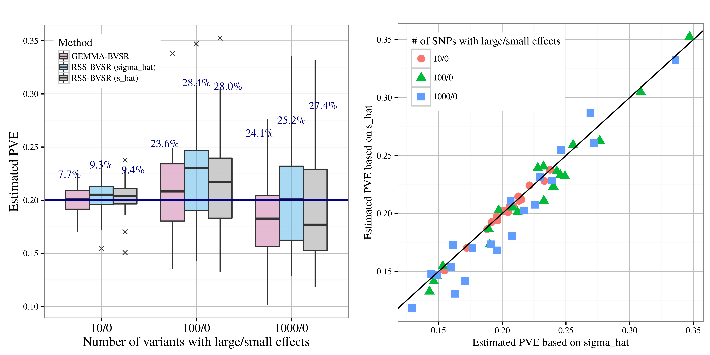

## Example 3: Choice of SE vector

### Overview
This example illustrates the impact of two definitions of `se` on the RSS results.

Here we consider two definitions below. The "simple" version is the standard error of the single-SNP effect estimate, which is often directly provided in the GWAS summary statistics database. The "rigorous" version is used in theoretical derivation (see Section 2.4 of RSS [paper](https://doi.org/10.1101/042457)), and it requires some basic calculations based on the available summary statistics.


In practice, we find these two definitions differ negligibly, mainly because

1. currently most GWAS have large sample size (`Nsnp`) and small effect sizes (`betahat`); see Table 1 of RSS [paper](https://doi.org/10.1101/042457);
2. the published summary data are often limited to two digits to further limit the possibility of identifiability (e.g. [GIANT](http://portals.broadinstitute.org/collaboration/giant/index.php/GIANT_consortium_data_files#GIANT_consortium_2012-2015_GWAS_Metadata_is_Available_Here_for_Download)). 

Hence, we speculate that using these two definitions of `se` exchangeably would not produce severely different results. In this example, we verify our guess by simulations. 

### Details
We use the same dataset in [Example 1](Example-1) for illustration. Please contact us if you have trouble downloading the dataset [`example1.mat`](https://uchicago.box.com/example1).

**To reproduce results of Example 3, please use [`example3.m`](https://github.com/stephenslab/rss/blob/master/examples/example3.m).**

Before running [`example3.m`](https://github.com/stephenslab/rss/blob/master/examples/example3.m), please make sure the [MCMC subroutines of RSS](https://github.com/stephenslab/rss/tree/master/src) are installed. See instructions [here](RSS-via-MCMC).

### Step-by-step illustration

**Step 1**. Define two types of `se`.

We let `se_1` and `se_2` denote the "simple"  and "rigorous" version respectively.
```matlab
se_1 = se;                                      % the simple version
se_2 = sqrt((betahat.^2) ./ Nsnp + se.^2);      % the rigorous version 
```
Before running MCMC, we first look at the difference between these two versions of `se`. Below is the five-number summary of the absolute difference between `se_1` and `se_2`.
```matlab
>> abs_diff = abs(se_1 - se_2);  
>> disp(prctile(log10(abs_diff), 0:25:100)); % require stat toolbox
  -12.0442   -4.6448   -3.9987   -3.4803   -1.3246
```
To make this example as "hard" as possible for `rss`, we do not round `se_1` and `se_2` to 2 significant digits.

**Step 2**. Fit RSS-BVSR using these two versions of `se`.
```matlab
[betasam_1, gammasam_1, hsam_1, logpisam_1, Naccept_1] = rss_bvsr(betahat, se_1, R, Nsnp, Ndraw, Nburn, Nthin);
[betasam_2, gammasam_2, hsam_2, logpisam_2, Naccept_2] = rss_bvsr(betahat, se_2, R, Nsnp, Ndraw, Nburn, Nthin);
```

**Step 3**. Compare the posterior output.

We can look at the posterior means of `beta`, and the posterior distributions of `h`, `log(pi)` and PVE based on `se_1` (blue) and `se_2` (orange).


The PVE estimate (with 95% credible interval) is 0.1932, [0.1166, 0.2869] when using `se_1`, and it is 0.1896, [0.1162, 0.2765] when using `se_2`.

### More simulations

The simulations in Section 2.3 of the RSS [paper](https://doi.org/10.1101/042457) (results shown in Supplement) are essentially "replications" of the example above. To facilitate reproducible research, we make the simulated datasets publicly available ([Scenario 2.1 datasets in `rss_example1_simulations.tar.gz`](https://uchicago.box.com/example1)).

After applying RSS methods to these simulated data, we obtain the following results. In the figures below, `sigma_hat` corresponds to `se_1`, and `s_hat` corresponds to `se_2`.

#### PVE estimation


#### Association detection
